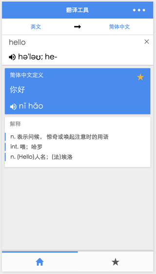

# 基于微信小程序开发框架的 Google Translate(IOS) 山寨版 (优质 demo 实现)



[点击查看DEMO演示录像](http://7xi3xn.com1.z0.glb.clouddn.com/wechat-mp-translate.mp4)

**声明: 此demo实现 只用于 经验分享/技术交流! 并且未在实际运行环境测试过。**

## 技术栈

- 微信小程序基础框架
- ES6/7
- ThenFail (Promise)
- Redux
- Less
- gulp
- node.js

客户端 UI/交互 仿照 google translate ios 版app, 该demo中使用的 翻译接口包含
**百度翻译** **百度语音** **有道翻译**

## 目录介绍

```
.
├── .gitignore                  # git ignore 配置
├── README.md                   # 帮助文档
├── app-cover.png               # 封面图
├── dist                        # 编译输出目录
├── gulpfile.js                 # gulp 配置
├── jsconfig.json               # vscode jsconfig.json
├── package.json                # node package.json
├── src                         # 源码目录
│   ├── action-type-map.js      # Redux action type 常量定义
│   ├── actions                 # Redux action handles
│   ├── apis                    # APIs handles
│   ├── app.js                  # app 入口文件
│   ├── app.json                # app 配置文件
│   ├── app.wxss                # app 初始样式
│   ├── assets                  # 资源
│   ├── commons                 # 通用模块
│   ├── config.js               # 项目运行参数配置, 该文件需要自行创建，参照 config.js.sample 文件
│   ├── config.js.sample        # 项目运行参数配置 样例文件
│   ├── constants.js            # 常量定义
│   ├── constants.wxss          # 样式常量
│   ├── pages                   # 页面业务实现
│   ├── reducers                # Redux reducers 定义
│   └── store.js                # Redux store 实例
├── test-server                 # 测试服务器 实现
├── typings                     # vsocde typings
└── yarn.lock                   # yarn...
```

## 使用

```
git clone https://github.com/maolion/wechat-mp-translate.git

cd wechat-mp-translate

npm install
# yarn install

cp src/config.js.sample src/config.js
# 如果需要 可以修改 src/config.js 的配置

npm run build && npm run server
```

然后在 微信web开发者工具里添加该项目, 项目目录是 ```path/to/wechat-mp-translate/dist```。
另外，在 微信web开发者工具里 取消该项目 的 ```开启 ES6 转 ES5``` 配置选项

## 源码编辑/调试

- 推介使用 EgretWing 编辑器
- 在项目根目录 创建 ```.wing/settings.json``` 文件, 并加入下面的配置

  ```
  {
    "files.associations": {
      "*.wxss": "less"
    }
  }
  ```

  或 如果使用 visual studio code 请在项目目录 创建 ```.vscode/settings.json``` 文件，
  并加入下面的配置

  ```
  {
    "files.associations": {
      "*.wxss": "less",
      "*.wxml": "html"
    }
  }
  ```

- 运行 ```npm run start```命令执行源代码同步编译
